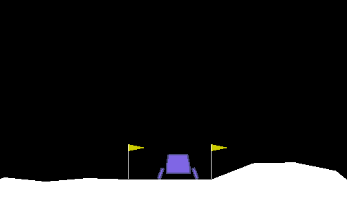
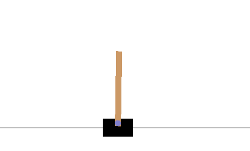

# Learning-RL

## Essential methods in reinforcement learning

> by Sigve Rokenes

Repo for keeping scripts written while researching the field. Public in case others interested in reinforcement learning are looking for code solutions. All scripts written in Python 3.6. Dependencies will probably be numpy and/or tensorflow for most scripts. Check the specific implementations for imports. All code released under the MIT license, so go wild!

See my website [evgiz.net](http://evgiz.net) for more extensive writeups of key projects. 

### Stationary k-armed bandit
Q learning in a stationary state space of probabilities length *k*, with a discrete action space *k*. Uses average reward over time for action value estimation. See `./bandit/k_bandit_stationary.py`


### Blackjack

The actor learns to play blackjack near optimally after ~ 5000 games of experience. Solved using state-action estimation and iterative policy improvement. Simplified code for the core learning algorithm is below. See `./monte_carlo/blackjack/blackjack_actor.py` for the full implementation.

```python
# State-action estimation
for s, a, r in experience:
	G = r + total_reward_after_s
	returns[(s,a)].append(G)
	q[s][a] = mean(returns[(s,a)])

# Policy estimation...
for s, _, _ in experience:
	policy[s] = argmax(q[s][a]))
```

For this task I have also implemented a blackjack simulation environment which is used to train the actor. See `./monte_carlo/blackjack/blackjack_environment.py`

## OpenAI Gym

### LunarLander-v2 (Deep Q Learning)



I solved the lunar lander environment using deep q learning. See `./gym/lunarlander-v2/*`. The network takes the current state and an action as input, and attempts to estimate the expected reward for the action given the current state:

`Q(S_t, A_t) = R_t + GAMMA * Q(S_t+1, argmax(Q(S_t+1))`

That is, the reward for the chosen action, plus the expected future reward following the current policy (as indicated by argmax). The actor keeps a replay memory of each state transition, and learns from a random sample of memory after each episode. The algorithm converges after about 1500 episodes. The task was confirmed solved after 1590 episodes (with an average score of 207 over 100 consecutive, non-training episodes).

Included with the code is the best model I achieved after a couple discrete training sessions. The best model trained for  4950 episodes and achieved an average score of 266. To run the pretrained model, execute:

`python lunarlander.py solved`

This will run 10 rendered episodes of the pretrained model as illustrated by the gif.

Read the full writeup of the project [here](http://evgiz.net/article/2019/02/02/).

**Dependencies:** Tensorflow, numpy, gym

### CartPole-v1 (Policy Gradient Ascent)



I solved the (discrete action space) cartpole environment using policy gradient ascent. See `./gym/cartpole-v1/*`.
The policy is estimated using a neural network which is updated directly without the use of a value function. The policy outputs the probability of each action for a given state (in this case the probabilities of moving left or right). The policy is trained in an offline fashion using real discounted rewards.

The problem was solved after 180 episodes in one trial, but the learning is quite unstable. This is a weakness with simple policy ascent, since the rewards are averaged for all actions over the episode and thus the model requires a large number of examples to converge. The results are significantly more stable after ~ 500 episodes however.

Included with the code is a model trained for 300 episodes achieving an average score of almost 500. To test it, execute:

`python policy_gradient.py solved`

References for this project include the RL book by Sutton & Barto and [this](https://medium.freecodecamp.org/an-introduction-to-policy-gradients-with-cartpole-and-doom-495b5ef2207f) great article on policy gradients by Thomas Simonini.


